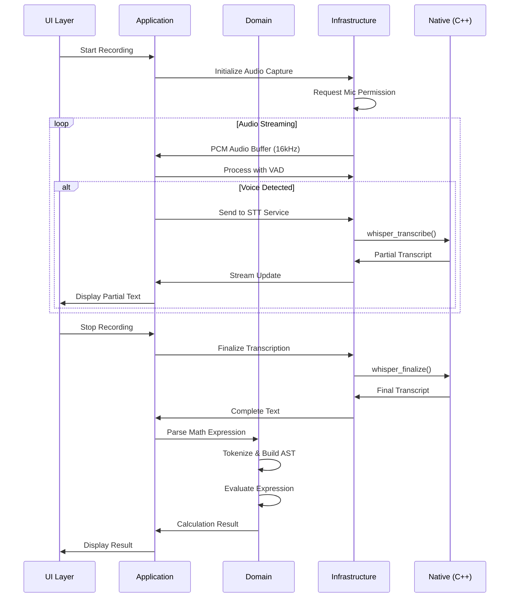

# Architecture Documentation

## Overview

This app follows Clean Architecture principles with clear separation of concerns and dependency inversion. The architecture ensures testability, maintainability, and platform independence.

## Layer Structure

```
┌─────────────────────────────────────────┐
│          Presentation Layer             │
│  (UI, Widgets, State Management)        │
├─────────────────────────────────────────┤
│          Application Layer              │
│    (Use Cases, Orchestration)           │
├─────────────────────────────────────────┤
│            Domain Layer                 │
│   (Entities, Business Logic, Ports)     │
├─────────────────────────────────────────┤
│         Infrastructure Layer            │
│  (Adapters, External Services, FFI)     │
└─────────────────────────────────────────┘
```

## Directory Structure

```
lib/
├── main.dart                      # App entry point
├── presentation/
│   ├── screens/
│   │   ├── record/
│   │   │   ├── record_screen.dart
│   │   │   └── widgets/
│   │   │       ├── audio_visualizer.dart
│   │   │       ├── transcript_display.dart
│   │   │       └── result_card.dart
│   │   ├── history/
│   │   │   ├── history_screen.dart
│   │   │   └── widgets/
│   │   │       └── history_item.dart
│   │   └── settings/
│   │       ├── settings_screen.dart
│   │       └── widgets/
│   │           └── model_selector.dart
│   ├── providers/                # Riverpod providers
│   │   ├── audio_provider.dart
│   │   ├── stt_provider.dart
│   │   └── settings_provider.dart
│   └── theme/
│       └── app_theme.dart
│
├── application/                   # Use cases & orchestration
│   ├── audio/
│   │   └── audio_capture_service.dart
│   ├── stt/
│   │   └── transcription_service.dart
│   └── math/
│       └── calculation_service.dart
│
├── domain/                        # Core business logic
│   ├── entities/
│   │   ├── audio_segment.dart
│   │   ├── transcript.dart
│   │   ├── calculation.dart
│   │   └── math_expression.dart
│   ├── math/
│   │   ├── parser.dart           # Narration → AST
│   │   ├── evaluator.dart        # AST → Result
│   │   └── number_words.dart     # "twenty" → 20
│   └── ports/                     # Interfaces
│       ├── stt_service.dart
│       ├── audio_service.dart
│       └── storage_service.dart
│
└── infrastructure/                # External dependencies
    ├── audio/
    │   ├── microphone_recorder.dart
    │   └── vad_processor.dart
    ├── stt/
    │   ├── whisper_ffi.dart      # Native bridge
    │   ├── whisper_mock.dart     # Testing/fallback
    │   └── online_stt_adapter.dart
    └── storage/
        ├── session_storage.dart
        └── preferences_storage.dart
```

## Data Flow

### Recording & Transcription Flow



### Math Parsing Pipeline

```
Input: "twenty-five times four plus ten percent"
           ↓
    [Tokenization]
           ↓
Tokens: [NUMBER(25), TIMES, NUMBER(4), PLUS, NUMBER(10), PERCENT]
           ↓
     [AST Building]
           ↓
AST:     Add
        /   \
     Mult    Percent
     /  \      |
   25    4    10
           ↓
    [Evaluation]
           ↓
Result: (25 × 4) + 10% = 100 + 10 = 110
```

## State Management (Riverpod)

### Provider Architecture

```dart
// Settings state
@riverpod
class Settings extends _$Settings {
  @override
  SettingsState build() => SettingsState.defaults();
  
  void toggleOfflineMode() {...}
  void selectModel(WhisperModel model) {...}
}

// Audio recording state
@riverpod
class AudioRecorder extends _$AudioRecorder {
  @override
  Stream<AudioState> build() async* {
    // Stream audio state changes
  }
  
  Future<void> start() async {...}
  Future<void> stop() async {...}
}

// Transcription state
@riverpod
class Transcription extends _$Transcription {
  @override
  Stream<TranscriptState> build() async* {
    // Stream transcript updates
  }
}
```

### State Flow

```
User Action → Provider → Service → Infrastructure → Native
     ↑                                              ↓
     └──────── State Update ← Provider ← Service ←─┘
```

## Key Design Patterns

### 1. Dependency Injection
- All dependencies injected via constructor
- Interfaces defined in domain layer
- Implementations in infrastructure layer

### 2. Repository Pattern
```dart
abstract class SessionRepository {
  Future<List<Session>> getAll();
  Future<void> save(Session session);
  Future<void> delete(String id);
}
```

### 3. Use Case Pattern
```dart
class TranscribeAudioUseCase {
  final STTService _sttService;
  final AudioProcessor _processor;
  
  Future<Transcript> execute(AudioBuffer audio) async {
    final processed = await _processor.prepare(audio);
    return _sttService.transcribe(processed);
  }
}
```

### 4. Factory Pattern
```dart
class STTServiceFactory {
  static STTService create(bool offline) {
    if (offline && Platform.isAndroid || Platform.isIOS) {
      return WhisperFFIService();
    }
    return OnlineSTTService();
  }
}
```

## Native Integration (FFI)

### Bridge Architecture

```
Dart Code
    ↓
[dart:ffi]
    ↓
Dynamic Library (.so/.a)
    ↓
C Wrapper (whisper_dart.c)
    ↓
Whisper.cpp (C++)
```

### FFI Interface

```dart
// Type definitions
typedef WhisperInitNative = Pointer<Void> Function(
  Pointer<Utf8> modelPath,
  Int32 threads,
);

typedef WhisperTranscribeNative = Int32 Function(
  Pointer<Void> ctx,
  Pointer<Float> pcm,
  Int32 frames,
  Pointer<Utf8> outText,
  Int32 outCap,
);

// Dart bindings
class WhisperBindings {
  late final DynamicLibrary _lib;
  late final WhisperInitNative init;
  late final WhisperTranscribeNative transcribe;
  
  WhisperBindings() {
    _lib = _loadLibrary();
    init = _lib.lookupFunction<...>('whisper_dart_init');
    transcribe = _lib.lookupFunction<...>('whisper_dart_transcribe');
  }
}
```

## Performance Considerations

### Memory Management
- Whisper model loaded once, reused
- Audio buffers pooled and recycled
- Transcripts pruned after session

### Threading
- Audio capture: Dedicated isolate
- Whisper inference: Native thread pool
- UI updates: Main isolate only

### Optimization Points
1. **VAD**: Reduces unnecessary processing
2. **Chunking**: Process audio in optimal sizes
3. **Caching**: Recent transcripts cached
4. **Lazy Loading**: Models loaded on-demand

## Security & Privacy

### Data Flow Security
```
Microphone → Memory Buffer → Native Processing → Result
                ↓ (Never)
            Network/Cloud
```

### Privacy Measures
1. No telemetry or analytics
2. Offline-first architecture
3. Explicit consent for online mode
4. No persistent audio storage
5. Session data encrypted at rest

## Testing Strategy

### Unit Tests
- Domain logic (parser, evaluator)
- Use cases
- State management

### Integration Tests
- Audio pipeline
- FFI bridge
- Storage layer

### Widget Tests
- Screen flows
- User interactions
- Accessibility

### Mock Architecture
```dart
class MockSTTService implements STTService {
  @override
  Stream<Transcript> transcribe(AudioBuffer audio) async* {
    // Simulate progressive transcription
    yield Transcript(text: "twenty", isFinal: false);
    yield Transcript(text: "twenty five", isFinal: false);
    yield Transcript(text: "twenty five times four", isFinal: true);
  }
}
```

## Error Handling

### Error Propagation
```
Native Error → C Wrapper → FFI → Service → Use Case → Provider → UI
```

### Recovery Strategies
1. **Model Loading Failure**: Fall back to online STT
2. **Microphone Unavailable**: Clear user guidance
3. **Parser Error**: Show raw transcript
4. **Memory Pressure**: Reduce model size

## Scalability

### Future Extensions
1. **Plugin Architecture**: Custom math operations
2. **Multi-Model Support**: Switch models dynamically
3. **Cloud Sync**: Optional backup/sync
4. **Collaborative Mode**: Share sessions

### Module Boundaries
- Each layer has clear interfaces
- New features added without modifying core
- Platform-specific code isolated
- Business logic platform-agnostic